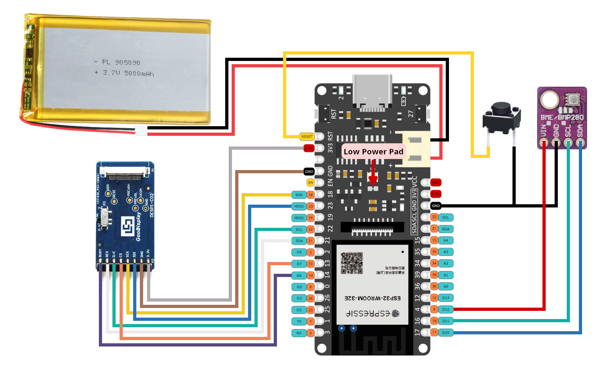

# Weather Station E-Ink — ESP32 + FPC-8612

Прошивка погодной станции для **FireBeetle 2 ESP32-E (DFR0654)** и
чёрно-белой E-Ink панели **7,5″, 800×480, FPC-8612** через адаптер
**DESPI-C02**.

Плата подключается к Wi-Fi, получает готовое изображение погоды из
[E-Ink Control Desk](https://weather-e-ink.vercel.app/), выводит его на экран
и переходит в Deep Sleep. Город, единицы измерения, интервал обновления и
состав карточек меняются через сайт — перепрошивать ESP32 после каждой
настройки не нужно.

## Содержание

- [Что понадобится](#что-понадобится)
- [Подключение дисплея](#подключение-дисплея)
- [Настройка панели через сайт](#настройка-панели-через-сайт)
- [Настройка прошивки](#настройка-прошивки)
- [Сборка и загрузка](#сборка-и-загрузка)
- [Как работает обновление](#как-работает-обновление)
- [Диагностика](#диагностика)
- [Безопасность](#безопасность)
- [Структура проекта](#структура-проекта)

## Что понадобится

- FireBeetle 2 ESP32-E, модель DFR0654;
- E-Ink дисплей FPC-8612 / DEPG0750RWF86BF30, 800×480;
- адаптер DESPI-C02;
- USB-C кабель с передачей данных;
- Wi-Fi сеть 2,4 ГГц с доступом в интернет;
- VS Code с расширением PlatformIO или PlatformIO Core.

Опционально можно подключить BME280/BMP280, внешнюю Reset-кнопку и Li-Po
аккумулятор 3,7–4,2 В. Прошивка полноценно запускается без этих компонентов.

Зависимости `GxEPD2` и `PNGdec` перечислены в `platformio.ini` и
загружаются PlatformIO автоматически.

## Подключение дисплея

Подключите DESPI-C02 к FireBeetle по таблице:

| DESPI-C02 | FireBeetle 2 ESP32-E | GPIO |
|---|---|---:|
| 3.3V | 3V3 | — |
| GND | GND | — |
| SDI | MOSI | 23 |
| SCK | SCK | 18 |
| CS | D7 | 13 |
| D/C | SCL | 22 |
| RES | SDA | 21 |
| BUSY | D6 | 14 |

### Полная схема подключения прототипа

Ниже приведена распиновка, по которой была собрана станция:



Помимо дисплея, на схеме показаны следующие соединения:

| Компонент | Контакт компонента | FireBeetle 2 ESP32-E |
|---|---|---|
| Li-Po аккумулятор 3,7 В | JST, плюс/минус | штатный разъём аккумулятора с соблюдением полярности |
| Кнопка | контакт 1 | RESET |
| Кнопка | контакт 2 | GND |
| BME/BMP280 | VIN | D13 / GPIO 12 |
| BME/BMP280 | GND | GND |
| BME/BMP280 | SCL | D11 / GPIO 16 |
| BME/BMP280 | SDA | D10 / GPIO 17 |

Стрелкой **Low Power Pad** отмечена площадка энергосберегающего режима на
FireBeetle. Работы с ней выполняйте только при полностью отключённых USB и
аккумуляторе.

### Необязательный BME280/BMP280

При каждом запуске прошивка автоматически проверяет I²C-адреса `0x76` и
`0x77`. Если подключён BMP280, считываются температура, давление и высота
(по стандартному давлению 1013,25 гПа). Для BME280 дополнительно читается
влажность. Показания уходят на сервер вместе с запросом `screen.png` и
вставляются в карточку **«Датчик BMP280»**, если она есть в макете Control
Desk. В Serial Monitor печатается тот же набор значений.

Если датчика нет, в логе появляется сообщение
`Optional BME/BMP280 not detected; continuing without sensor`, после чего
обычное получение погоды и обновление экрана продолжаются. Ошибка на E-Ink не
показывается. После проверки GPIO 12 отключает питание модуля для экономии
заряда во время Deep Sleep.

Внешняя кнопка между `RESET` и `GND` работает аппаратно и не требует отдельной
логики в прошивке. Зарядка и питание от аккумулятора через штатный JST-разъём
управляются самой платой FireBeetle.

Важно:

- подавайте на DESPI-C02 только **3,3 В**, не VCC/5V;
- установите переключатель `RESE` на адаптере в положение `0.47Ω`;
- выполняйте подключение при отключённом USB-питании;
- совместите контакт 1 шлейфа экрана с контактом 1 разъёма адаптера;
- при прямой установке экран и сторона DESPI-C02 с компонентами должны
  смотреть вверх;
- полное обновление E-Ink занимает примерно 20–30 секунд.

## Настройка панели через сайт

### 1. Войдите в Control Desk

Откройте [weather-e-ink.vercel.app](https://weather-e-ink.vercel.app/) и
войдите с логином и паролем владельца панели.

Сайт хранит настройки экрана и формирует персональное PNG-изображение. Имя и
пароль Wi-Fi на сайт не передаются: они остаются только в прошивке ESP32.

### 2. Задайте место и формат

В разделе **«01 — Место и формат»** настройте:

1. **Название панели** — произвольное понятное имя устройства.
2. **Город** — введите минимум два символа и обязательно выберите подходящий
   город из выпадающего списка. Вместе с городом сайт сохранит координаты и
   правильный часовой пояс.
3. При желании нажмите **«Определить по GPS»** и разрешите браузеру доступ к
   геопозиции. Координаты запрашиваются только после нажатия этой кнопки.
4. Выберите язык: **Русский** или **English**.
5. Выберите единицы:
   - метрические — `°C`, `м/с`, `мм`;
   - имперские — `°F`, `mph`, `inHg`.
6. Выберите интервал обновления: от 5 минут до 1 дня. Пункт
   **«Свой интервал»** позволяет указать любое целое значение от 5 до 1440
   минут.

### 3. Соберите макет экрана

Справа находится живой предпросмотр 800×480. Карточки редактируются прямо на
макете:

- перетаскивайте карточку за значок `⠿`, чтобы изменить порядок;
- выберите другой тип карточки в выпадающем списке на ней;
- задайте ширину от `1/4` до `4/4`;
- удалите карточку кнопкой `×`;
- добавьте новую через **«+ Добавить карточку»** в свободном месте.

Доступны температура, погодная сцена, часы, почасовой и семидневный прогноз,
графики температуры/осадков/ветра, влажность, давление, видимость, точка росы,
качество воздуха, облачность, восход и закат, УФ-индекс, карточка датчика
BMP280 и другие показатели. Макет ограничен **8 карточками и двумя рядами**.
Если комбинация не помещается, редактор не применит её и покажет сообщение.

Карточка **«Датчик BMP280»** в предпросмотре сайта заполняется примером. На
физическом экране в неё попадают живые показания с платы: температура,
давление, высота и влажность (если это BME280).

Предпросмотр погоды обновляется автоматически. Ссылка **«Открыть PNG»**
показывает изображение 800×480 без данных с ESP32; живые показания датчика
приходят только в запросе самой платы.

### 4. Сохраните изменения

Нажмите **«Сохранить изменения»** и дождитесь сообщения
**«Настройки сохранены»**. Несохранённые изменения видны в предпросмотре, но
не будут отданы устройству.

Новая конфигурация появится на физическом экране при следующем пробуждении
ESP32. Чтобы проверить её сразу, перезагрузите плату кнопкой Reset или
кратковременно отключите питание.

### 5. Скопируйте ссылку устройства

В разделе **«02 — Ссылка устройства»** нажмите **«Копировать URL»**. Нужен
только базовый персональный адрес вида:

```text
https://weather-e-ink.vercel.app/d/ВАШ_ПЕРСОНАЛЬНЫЙ_ID
```

Не добавляйте в `DEVICE_BASE_URL` `/screen.png`, `/config` или завершающий
слеш. Прошивка сама запрашивает `DEVICE_BASE_URL/screen.png`.

Кнопка **«Заменить»** создаёт новую персональную ссылку и немедленно отключает
старую. После замены обновите `DEVICE_BASE_URL` в `src/secrets.h` и заново
прошейте плату.

Адрес с окончанием `/config` предназначен для просмотра машинной конфигурации.
Текущая прошивка обращается к нему не отдельно: интервал следующего обновления
приходит вместе с PNG в HTTP-заголовке.

## Настройка прошивки

Клонируйте репозиторий и откройте его в VS Code:

```bash
git clone https://github.com/MkinG2k0/weather-station-esp.git
cd weather-station-esp
```

Создайте локальный файл `src/secrets.h` на основе примера.

PowerShell:

```powershell
Copy-Item src/secrets.example.h src/secrets.h
```

Linux/macOS:

```bash
cp src/secrets.example.h src/secrets.h
```

Заполните три значения:

```cpp
#pragma once

constexpr char WIFI_SSID[] = "имя-сети-2.4-GHz";
constexpr char WIFI_PASSWORD[] = "пароль-Wi-Fi";
constexpr char DEVICE_BASE_URL[] =
    "https://weather-e-ink.vercel.app/d/ВАШ_ПЕРСОНАЛЬНЫЙ_ID";
```

`src/secrets.h` добавлен в `.gitignore` и не должен попадать в Git. Файл
`src/secrets.example.h` содержит только пример формата.

## Сборка и загрузка

### Через VS Code

1. Установите расширение **PlatformIO IDE**.
2. Откройте папку проекта.
3. Подключите FireBeetle кабелем USB-C с передачей данных.
4. Если плата определилась не как `COM5`, измените `upload_port` и
   `monitor_port` в `platformio.ini` или удалите эти строки для
   автоматического выбора порта.
5. Выполните **PlatformIO: Build**.
6. Выполните **PlatformIO: Upload**.
7. Откройте **PlatformIO: Serial Monitor** со скоростью 115200 бод.

### Через PlatformIO Core

```bash
pio run
pio run --target upload
pio device monitor --baud 115200
```

После загрузки плата подключится к Wi-Fi, скачает PNG и выполнит полное
обновление дисплея. Во время прошивки иногда требуется удерживать кнопку
`BOOT`; это зависит от USB-UART драйвера и режима загрузки конкретной платы.

## Как работает обновление

Один цикл выглядит так:

1. ESP32 просыпается, читает BMP280/BME280 (если он подключён) и подключается к Wi-Fi.
2. Выполняет HTTPS-запрос к `DEVICE_BASE_URL/screen.png` и передаёт показания
   датчика в query (`chip`, `temp_c`, `pressure_hpa`, `altitude_m`, при BME280
   ещё `humidity`). Сервер рисует их в карточке датчика.
3. Проверяет тип, размер и сигнатуру PNG 800×480.
4. Если изображение изменилось, выводит его на E-Ink.
5. Отключает Wi-Fi и засыпает до следующего обновления.

Сервер передаёт период сна в заголовке `X-Next-Refresh-Seconds`. С 23:00 до
06:00 по часовому поясу выбранного города интервал составляет не менее одного
часа. При сетевой ошибке плата повторяет попытку через 30 секунд.

ETag последнего ответа и локальный хеш изображения хранятся в RTC-памяти. Если
погода не изменилась, сервер отвечает `304 Not Modified`, PNG не передаётся и
ресурс дисплея не расходуется на лишнее полное обновление. После полного
отключения питания RTC-память очищается, поэтому первый запуск снова загружает
и выводит изображение.

Для экономии RAM PNG рисуется шестью проходами по 80 строк. Максимальный размер
загружаемого файла — 64 КиБ.

## Диагностика

Откройте Serial Monitor на скорости **115200 бод**. Основные сообщения:

| Сообщение | Что проверить |
|---|---|
| `Wi-Fi connection failed` | SSID, пароль, наличие сети 2,4 ГГц и уровень сигнала |
| `DEVICE_BASE_URL is empty` | Заполнен ли `DEVICE_BASE_URL` в `src/secrets.h` |
| `HTTP error: 404` | Не была ли персональная ссылка заменена в Control Desk |
| `Unexpected Content-Type` | Открывается ли `DEVICE_BASE_URL/screen.png` в браузере как PNG |
| `Unexpected PNG dimensions` | Сервер должен вернуть изображение ровно 800×480 |
| `PNG decode error` | Повторите загрузку; проверьте стабильность сети и размер ответа |
| `Screen unchanged (ETag)` | Нормальный режим: данные не изменились, обновление пропущено |
| `Deep sleep for ... seconds` | Нормальный режим: плата закончила цикл и уснула |

Если изображение не появляется:

- ещё раз проверьте все GPIO по таблице и общий GND;
- убедитесь, что DESPI-C02 питается от 3,3 В и `RESE` стоит на `0.47Ω`;
- проверьте ориентацию шлейфа и контакт 1;
- дождитесь 30 секунд после начала обновления;
- нажмите Reset и просмотрите полный лог загрузки.

Если настройки на сайте изменены, но экран старый, сначала нажмите
**«Сохранить изменения»**, затем дождитесь следующего цикла. Для немедленной
проверки откройте **«Открыть PNG»** на сайте и перезагрузите ESP32.

## Безопасность

- Не коммитьте `src/secrets.h` и не публикуйте пароль Wi-Fi.
- Персональный URL фактически является ключом чтения экрана. Не размещайте его
  в скриншотах и публичных логах. При утечке используйте кнопку **«Заменить»**.
- В текущей версии прошивки используется `WiFiClientSecure::setInsecure()`:
  HTTPS-трафик шифруется, но сертификат сервера не проверяется. Для эксплуатации
  в недоверенной сети рекомендуется добавить корневой сертификат и включить
  его проверку.

## Структура проекта

```text
platformio.ini                  окружение PlatformIO и зависимости
src/main.cpp                    Wi-Fi, HTTPS, PNG, E-Ink и Deep Sleep
src/GxEPD2_750c_86BF.*          драйвер панели FPC-8612
src/secrets.example.h           шаблон локальных настроек
src/secrets.h                   локальные секреты, не хранится в Git
dist/                           тестовые бинарники и изображения
tools/convert_photo.py          преобразование фото в монохром 800×480
```

## Почему используется отдельный драйвер

FPC-8612 также встречается под обозначением `DEPG0750RWF86BF30`. Его
последовательность инициализации отличается от обычной `GxEPD2_750c_Z08`,
поэтому в проект включён адаптированный драйвер `GxEPD2_750c_86BF`.

Драйвер основан на MIT-проекте
[`lumixen/gxepd2-rwf86bf`](https://github.com/lumixen/gxepd2-rwf86bf).
Текст лицензии находится в файле `LICENSE`.
